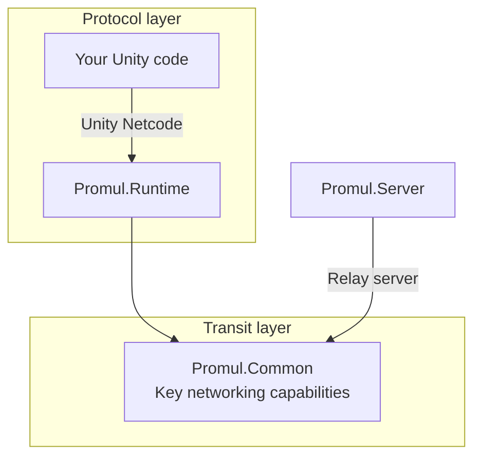
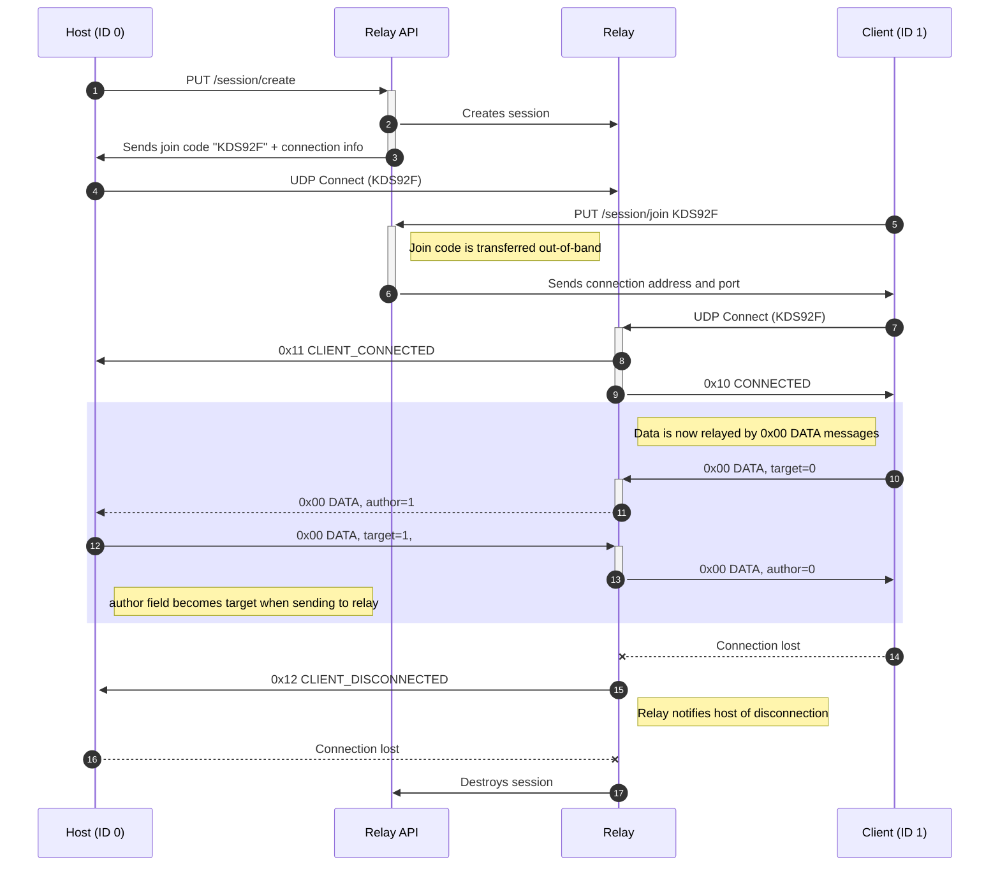

# Promul
Promul is a simple, lightweight, and easy-to-use relay server and session management implementation for [Unity Netcode for GameObjects](https://docs-multiplayer.unity3d.com/netcode/current/about/). 
  
Promul uses a heavily-modified version of the [LibNetLib](https://github.com/RevenantX/LiteNetLib) library for its internal networking, converting the library from a thread-based non-async model to a Task-based Asynchronous Programming (TAP)-based implementation.
Technical details of the networking are explained in engineering section below.
  
Promul is intended to be a free and open-source alternative to [Unity Relay](https://unity.com/products/relay). It supports join secret-based session management, with a REST API for creating and deleting sessions, and an admin UI for managing active sessions.

## Setup
#### Relay server and API
Clone this repository and build and run the program under [/Server](/Server). The relay server will bind on UDP port 4098 while the API server will bind on TCP port 3000.

To create a new session, call `PUT /session/create`. The API will respond with the join code.

#### Relay client (Transport)
Install the transport by adding it in the Unity Package Manager by git URL:  
`https://github.com/jacksonrakena/Promul.git`
  
Next, add `PromulTransport` to your NetworkManager GameObject. Set the `Address` and `Port` to the address and port of your relay server.  

Example:  
  
  

You should now be ready to use Promul as a relay server for your Unity project. You can call `NetworkManager`'s `StartHost`/`StartClient`/`StartServer` methods as normal.

## Engineering


### Transit layer
Promul's included networking solution is a very heavily modified version of the amazing [LibNetLib](https://github.com/RevenantX/LiteNetLib) by Ruslan Pyrch.

Promul is *probably* compatible with LibNetLib clients and servers. I don't know, and I don't check.  
Compatibility with LibNetLib is not a goal of Promul.

#### Differences from LibNetLib
Among other differences:
- The library requires .NET Standard 2.1.
    - This limits the Unity versions that can use the library, but also
      allows the library to use newer constructs such as `ArraySegment<T>`.
- The `NetDataReader` and `NetDataWriter` classes have been removed in favour of `BinaryReader` and `BinaryWriter` from `System.IO`.
    - This means support for `INetSerializable` has been removed. Clients are expected to create extension overloads for `BinaryWriter.Write` and `BinaryReader.Read{Type}`.
- The logic and receive threads have been removed, in favour of a long-running `Task` spawned by the `NetManager`.
- Most of the library's blocking methods have been replaced with Task-based Asynchronous Programming (TAP) methods, using `Task`. This requires
  a significant rewrite of most parts of the library.
- NAT punch-through and manual mode have both been removed.
    - The transport will now put transport events onto a queue,
      and `NetworkTransport#PollEvents` will dequeue events and pass them to Unity Netcode.
- `NetManager#Start` has been replaced by `PromulManager#ListenAsync`, which will begin infinitely looping, waiting for incoming messages.
    - This method will block, so in the Unity transport, it is spawned on an un-awaited `Task`.
    - Servers are expected to use a paradigm such as `BackgroundService` to run the long-running `Task`.
- Documentation has been improved.
- `NetPacket` no longer has jurisdiction over its data. It is a wrapper around an `ArraySegment<byte>`.
- Most (if not all) usages of `byte[] data, int offset, int count` have been replaced with `ArraySegment<byte>`.
- `INetBasedListener` and related classes have been removed. All events
  are invoked on the `PromulManager` class as
  regular CLR `event` types.
- In many classes, extraneous overloads have been removed in favour of default parameters.
### Protocol layer
Promul's Unity relay uses its own wire protocol over the transit layer. The protocol is shown in the following diagram:


## Roadmap
### Engineering &mdash; Transit/Protocol
- [x] Task-based asynchronous programming rewrite
- [x] Authentication and binding tests
- [x] MTU negotation tests
- [ ] Replace logging with a better solution
- [ ] Restore merged sending support
- [ ] Restore NAT punch-through(?)
- [ ] Improve memory and throughput performance
- [ ] More real-world replications in tests
- [ ] More uses of `ValueTask<T>` over regular tasks
### Relay Server
- [x] Basic create/join session by join code
  - [x] Update session manager
- [x] Basic web interface
  - [ ] Further development of web interface
- [ ] Multicast(?)
## Copyright
&copy; 2023 Firework Eyes Studio (NZBN 9429048922678) under the MIT License.

This project uses a heavily modified version of LibNetLib.  
LiteNetLib &copy; 2020 Ruslan Pyrch, under the following license:
```
MIT License

Copyright (c) 2020 Ruslan Pyrch

Permission is hereby granted, free of charge, to any person obtaining a copy
of this software and associated documentation files (the "Software"), to deal
in the Software without restriction, including without limitation the rights
to use, copy, modify, merge, publish, distribute, sublicense, and/or sell
copies of the Software, and to permit persons to whom the Software is
furnished to do so, subject to the following conditions:

The above copyright notice and this permission notice shall be included in all
copies or substantial portions of the Software.

THE SOFTWARE IS PROVIDED "AS IS", WITHOUT WARRANTY OF ANY KIND, EXPRESS OR
IMPLIED, INCLUDING BUT NOT LIMITED TO THE WARRANTIES OF MERCHANTABILITY,
FITNESS FOR A PARTICULAR PURPOSE AND NONINFRINGEMENT. IN NO EVENT SHALL THE
AUTHORS OR COPYRIGHT HOLDERS BE LIABLE FOR ANY CLAIM, DAMAGES OR OTHER
LIABILITY, WHETHER IN AN ACTION OF CONTRACT, TORT OR OTHERWISE, ARISING FROM,
OUT OF OR IN CONNECTION WITH THE SOFTWARE OR THE USE OR OTHER DEALINGS IN THE
SOFTWARE.
```
