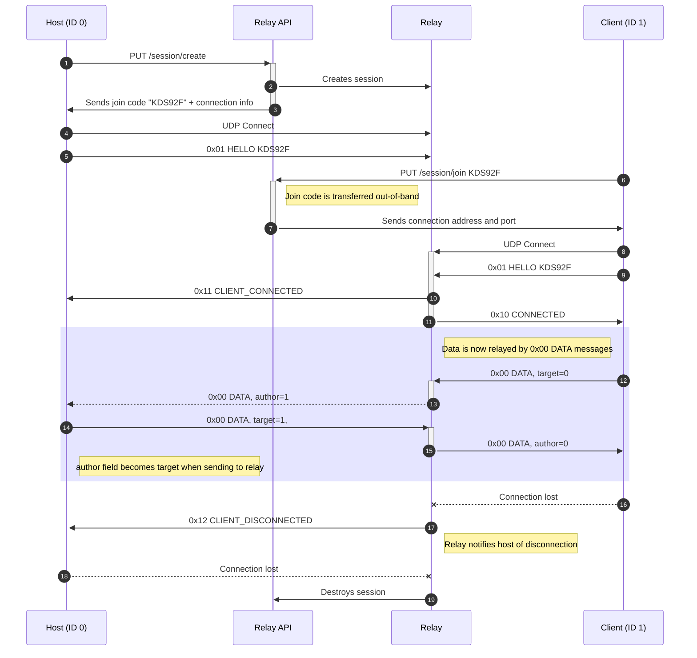

# Promul
Using the [LibNetLib](https://github.com/RevenantX/LiteNetLib) reliable UDP library, Promul is a simple, lightweight, and easy-to-use relay server implementation for [Unity Netcode for GameObjects](https://docs-multiplayer.unity3d.com/netcode/current/about/). 
  
Promul serves as a free and open-source alternative to [Unity Relay](https://unity.com/products/relay). In the future, we would like to add automatic provisioning of Promul instances behind a REST API, including a secret join code mechanism, to bring Promul into feature parity with Unity Relay.

## Setup
#### Relay server
Clone this repository and build and run the program under [/Server](/Server). Promul will bind on port 4098.

#### Relay client (Transport)
Install the transport by adding it in the Unity Package Manager by git URL:  
`https://github.com/jacksonrakena/Promul.git`
  
Next, add `PromulTransport` to your NetworkManager GameObject. Set the `Address` and `Port` to the address and port of your relay server.  

Example:  
  
  

You should now be ready to use Promul as a relay server for your Unity project. You can call `NetworkManager`'s `StartHost`/`StartClient`/`StartServer` methods as normal.

## Engineering
### Protocol
Promul uses its own wire protocol over LibNetLib. The protocol is shown in the following diagram:

## Copyright
&copy; 2023 Firework Eyes Studio (NZBN 9429048922678) under the MIT License.

LiteNetLib &copy; 2020 Ruslan Pyrch, under the following license:
```
MIT License

Copyright (c) 2020 Ruslan Pyrch

Permission is hereby granted, free of charge, to any person obtaining a copy
of this software and associated documentation files (the "Software"), to deal
in the Software without restriction, including without limitation the rights
to use, copy, modify, merge, publish, distribute, sublicense, and/or sell
copies of the Software, and to permit persons to whom the Software is
furnished to do so, subject to the following conditions:

The above copyright notice and this permission notice shall be included in all
copies or substantial portions of the Software.

THE SOFTWARE IS PROVIDED "AS IS", WITHOUT WARRANTY OF ANY KIND, EXPRESS OR
IMPLIED, INCLUDING BUT NOT LIMITED TO THE WARRANTIES OF MERCHANTABILITY,
FITNESS FOR A PARTICULAR PURPOSE AND NONINFRINGEMENT. IN NO EVENT SHALL THE
AUTHORS OR COPYRIGHT HOLDERS BE LIABLE FOR ANY CLAIM, DAMAGES OR OTHER
LIABILITY, WHETHER IN AN ACTION OF CONTRACT, TORT OR OTHERWISE, ARISING FROM,
OUT OF OR IN CONNECTION WITH THE SOFTWARE OR THE USE OR OTHER DEALINGS IN THE
SOFTWARE.
```
