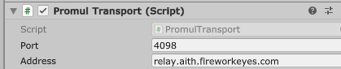

# Promul
Using the [LibNetLib](https://github.com/RevenantX/LiteNetLib) reliable UDP library, Promul is a simple, lightweight, and easy-to-use relay server implementation for [Unity Netcode for GameObjects](https://docs-multiplayer.unity3d.com/netcode/current/about/). 
  
Promul serves as a free and open-source alternative to [Unity Relay](https://unity.com/products/relay). In the future, we would like to add automatic provisioning of Promul instances behind a REST API, including a secret join code mechanism, to bring Promul into feature parity with Unity Relay.

## Setup
#### Relay server
Clone this repository and build and run the program under [/Server](/Server). Promul will bind on port 4098.
#### Relay client (Transport)
Install the transport by adding it in the Unity Package Manager by git URL:  
`https://github.com/jacksonrakena/Promul.git?path=/Transport/`
  
Next, add `PromulTransport` to your NetworkManager GameObject. Set the `Address` and `Port` to the address and port of your relay server.  

Example:  
  
  

You should now be ready to use Promul as a relay server for your Unity project. You can call `NetworkManager`'s `StartHost`/`StartClient`/`StartServer` methods as normal.

## Copyright
&copy; 2023 Firework Eyes Studio (NZBN 9429048922678) under the MIT License.
